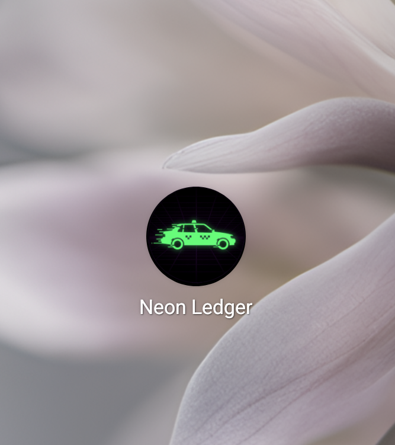
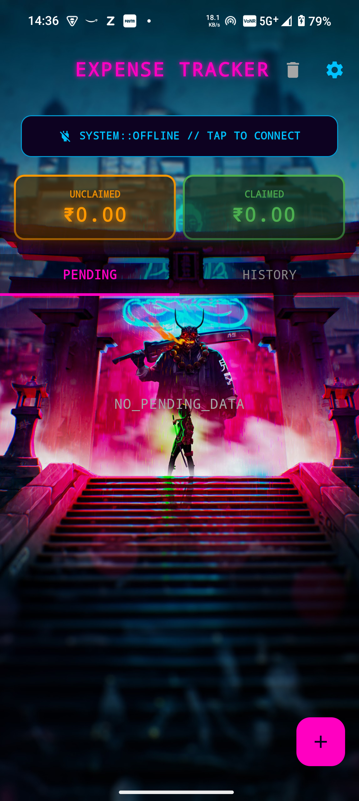
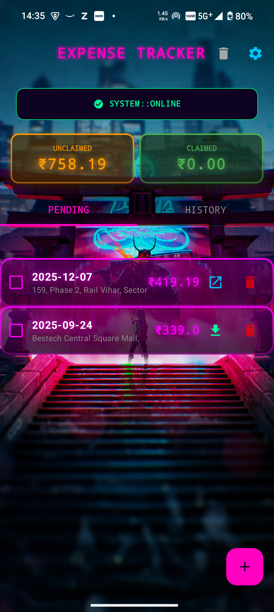

<div align="center">



# Neon Ledger: Uber & Rapido Expense Tracker

**A local-first, cyberpunk-themed Android application for automatically tracking and managing your ride expenses.**


</div>

---

## 🎯 Problem Statement

Keeping track of business rides for reimbursement claims is chaotic. Receipts get buried in emails, manual entry is tedious, and missed claims cost money. **Neon Ledger** solves this by automating the entire process—fetching receipts, parsing data, and generating Excel reports—wrapped in a sleek, privacy-focused interface.

---

## 🎨 Interface & Demos

### 🚀 System Initialization
The app features a custom "System Boot" splash screen animation that plays while the secure local database initializes.

<div align="center">
  
  <br>
  <em>(Custom Canvas-based Particle Animation)</em>
</div>

<br>

### 📱 Dashboard & Tracking
The main dashboard provides a clear split between **Claimed** and **Unclaimed** expenses. It uses a glass-morphism cyberpunk aesthetic with neon glows to indicate selection states.

<div align="center">
  <table>
    <tr>
      <td align="center"><b>Offline / Empty State</b></td>
      <td align="center"><b>Live Dashboard</b></td>
    </tr>
    <tr>
      <td align="center">
        
      </td>
      <td align="center">
        
      </td>
    </tr>
    <tr>
      <td align="center"><em>Initial state before Gmail sync</em></td>
      <td align="center"><em>Auto-fetched Uber & Rapido rides</em></td>
    </tr>
  </table>
</div>

---

## ✨ Key Features

### 🤖 **Automated Receipt Parsing**
- **Gmail Integration:** Securely connects via Google Sign-In (Read-Only access).
- **Smart Parsers:** Custom HTML parsers (`Jsoup`) specifically built for **Uber** and **Rapido** email receipts.
- **Background Sync:** Uses `WorkManager` to run scheduled sync jobs at 11:00, 15:00, and 20:00 daily.

### 📊 **Expense Management**
- **Claim Status:** distinct workflow for "Pending" vs "History" (Claimed) rides.
- **Excel Export:** Generates professional `.xlsx` reports using **Apache POI**. Includes automatic PDF receipt downloading for selected rides.
- **Recycle Bin:** Safely delete rides with a "Trash" and "Restore" feature (Soft Delete).

### ⚙️ **Customization & Controls**
- **Manual Overrides:** Add rides manually if an email is missing.
- **Custom Senders:** Configure specific email addresses to scan (useful for forwarded receipts).
- **Direct Access:** Open original PDF receipts or email links directly from the dashboard.

### 🔐 **Privacy-First Architecture**
- **Local Storage:** All data is stored locally in a **Room Database**.
- **No External Servers:** Your ride data never leaves your device except when you share an Excel report.
- **Encrypted Preferences:** Sensitive tokens are stored using `EncryptedSharedPreferences`.

---

## 🏗️ Tech Stack

- **Language:** Kotlin
- **UI Toolkit:** Jetpack Compose (Material 3) with custom Canvas animations
- **Architecture:** MVVM (Model-View-ViewModel)
- **Local Data:** Room Database (SQLite)
- **Networking:** Google Gmail API (v1)
- **Parsing:** Jsoup (HTML) & Apache POI (Excel)
- **Background Jobs:** Android WorkManager

---

## 🚀 Quick Start

**Prerequisites:**
* Android Studio Ladybug or newer (Agp 8.13.0+)
* A Google Cloud Project with **Gmail API** enabled.

**Setup:**

1.  **Clone the repository:**
    ```bash
    git clone [https://github.com/frost-biter/uber-expense-tracker.git](https://github.com/frost-biter/uber-expense-tracker.git)
    ```
2.  **Configure OAuth:**
    * Go to Google Cloud Console.
    * Create an OAuth 2.0 Client ID (Android).
    * Add your local `debug.keystore` SHA-1 fingerprint.
3.  **Build:**
    * Sync Gradle and run on an emulator/device.
4.  **First Run:**
    * Tap "TAP TO CONNECT" on the home screen to authorize Gmail access.

---

## 📱 Usage Guide

1.  **Syncing:** The app automatically checks for emails from `uber.com` and `rapido.bike`. You can verify connection status in the "System Status" strip.
2.  **Exporting:** Long-press a ride to enter selection mode -> Select rides -> Click **Claim** to generate an Excel report.
3.  **Recovering:** Accidentally deleted a ride? Go to **Settings -> Trash** to restore it.